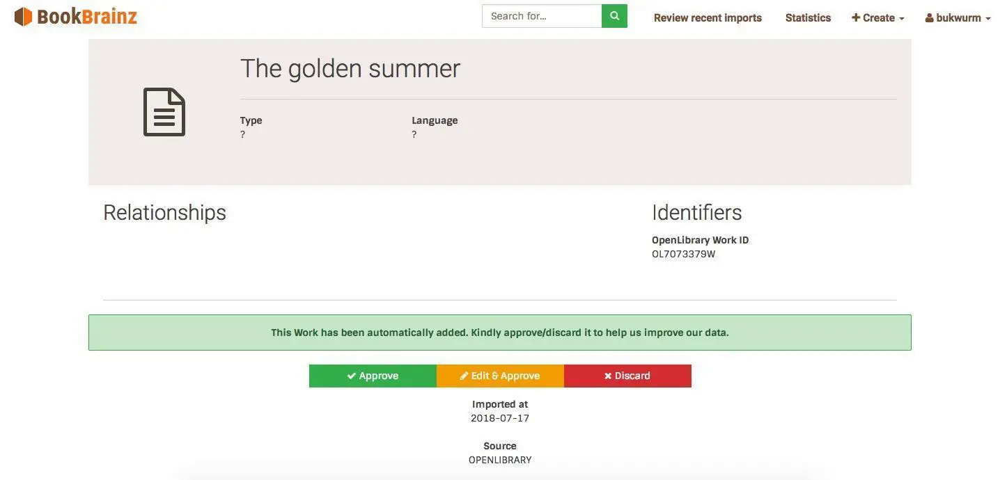

# Contact Information

- **Name**: David Kellner
- **Email**: [redacted] <small>(*I will not publish my email address in a public place, but mentors can find it in the PDF version of my proposal for the GSoC website.*)</small>
- **Libera.Chat IRC**: kellnerd
- **GitHub**: [kellnerd](https://github.com/kellnerd)
- **Timezone**: UTC+02:00 (Central European Summer Time)

# Proposed Project

BookBrainz still has a relatively small community and contains less entities than other comparable databases.
Therefore we want to provide a way to import available collections of library records into the database while still ensuring that they meet BookBrainz' high data quality standards.

From a previous GSoC project in 2018, the database schema already contains additional tables set up for that purpose, where the imports will await a user's approval before becoming a fully accepted entity in the database.

The project will require processing very large data dumps (e.g. [MARC] records or [JSON] files) in a robust way and transforming entities from one database schema to the BookBrainz schema.
Additionally the whole process should be repeatable without creating duplicate entries.

My previous GSoC project from 2023 [^blog-2023] has achieved this for *standalone entities*, but it is not very useful to import works or editions without being able to link them to their authors, for example.
So there is still a good amount of work ahead to adapt this process to import a *full set of related entities* and deal with all the edge cases.

**Project size**: Medium (175 hours)

[^blog-2023]: Blog post: [GSoC 2023: Reviving the BookBrainz importer project](https://blog.metabrainz.org/2023/11/06/gsoc-2023-reviving-the-bookbrainz-importer-project/)

[JSON]: https://www.json.org/json-en.html
[MARC]: https://www.loc.gov/marc/

# Overview: The Import Process

Before I will start to explain the software architecture of the import process, let us agree on common terms for the different states of the imported data:

**External Entity**
: An entity which has been extracted from a certain external data source (i.e. a database dump or an API response) in its original format.

**Parsed Entity**
: A JSON representation of the external entity which is compatible with the BookBrainz ORM.
	The JSON may also contain additional data which can not be represented within the current BookBrainz schema.

**Pending Entity**
: The entity has been imported into the BookBrainz database schema, but has not been approved (or discarded) by a user so far.
	The additional data of the parsed entity will be kept in a freeform JSON column.

**Accepted Entity**
: The imported entity has been accepted by a user and now has the same status as a regularly added entity.

## Existing Infrastructure

Infrastructure to import entities into BookBrainz had already been developed in a previous GSoC project from 2018 [^blog-2018].
Last year I modernized the whole codebase of the backend, fixed bugs and rewrote parts of it from scratch.
The architecture consists of two separate types of services which are connected by a [RabbitMQ] messaging queue which acts as a processing queue:

1. **Producer**: Extracts external entities from a database dump (or an API) and emits parsed entities which are inserted into the queue.
	Each external data source has its own specific producer implementation although parts of it can be shared.
	Since the parsed entities are queued for insertion into the database, there can be multiple producer instances running in parallel.

2. **Consumer**: Takes parsed entities from the queue and validates them before they are passed to the ORM which inserts them into the database as a pending entity.

The processing queue acts as a buffer to make the fast parsing logic independent from the slow database insertion process.
It also allows the consumer to be stopped or interrupted without losing data and the import process can be continued at any time.


As soon as a pending entity is available in the database, it can be browsed on the website [^site-pr].
The page looks similar to that of an accepted entity, but provides different action buttons at the bottom.
Here the user can choose whether they want to discard, approve or edit and approve the entity.

Once an entity gets approved, the server assigns it a BBID and creates an initial entity revision to which the approving user's browser is redirected.



While a pending entity can be promoted to an accepted entity by a single vote, the pending import will only be deleted if it has been discarded by multiple users.
This is done in order to prevent losing pending entities (which have no previous revision that can be restored!) forever by accident.
And usually we do not want to restore discarded entities when we decide to repeat the import process.

[^blog-2018]: Blog post: [GSoC 2018: Developing infrastructure for importing data into BookBrainz](https://blog.metabrainz.org/2018/08/13/gsoc-2018-developing-infrastructure-for-importing-data-into-bookbrainz/)

[^site-pr]: Once the open pull request with the website changes has been merged: [bookbrainz-site#201]

[RabbitMQ]: https://www.rabbitmq.com/
[bookbrainz-site#201]: https://github.com/metabrainz/bookbrainz-site/pull/201

## Shortcomings of the Current Implementation

### No Support for Relationships Between Pending Entities

A producer reads one external entity at a time and only emits a single parsed entity without any relationships to other entities at that point.
It would be the consumer's task to resolve the available names and identifiers of the related entities to existing pending entities or even accepted entities.
If the entity resolution does not succeed, the consumer additionally has to create the related pending entities with the minimal information that is currently available.

But pending entities currently only have aliases, identifiers and basic properties (such as annotation, languages, dates) which are specific per entity type.
Allowing them to also have relationships could potentially lead to relationships between pending and accepted entities, because BookBrainz uses *bidirectional relationships* (new relationships also have to be added to the respective relationship's target entity).
In order to prevent opening that can of worms, relationships are currently stored in the additional freeform data of pending entities.

While this was an intentional decision to reduce the complexity of the project in 2018 [^proposal-2018], it is not a viable long term solution.
Importing e.g. a work without at least a relationship to its author saves little work for the users, so we really need to support relationships this time.

|                    | **Accepted Entity** (Standard) | **Pending Entity** (Import) |
| ------------------ | :----------------------------: | :-------------------------: |
|                    |       ![Accepted entity]       |   ![Pending entity 2018]    |
| Basic properties   |               ✓                |              ✓              |
| Aliases            |               ✓                |              ✓              |
| Identifiers        |               ✓                |              ✓              |
| Relationships [^1] |               ✓                |              ✗              |
| BBID               |               ✓                |              ✗              |
| Revision number    |               ✓                |              ✗              |
| Freeform data      |               ✗                |              ✓              |

Table: Current features of pending entities

[^1]: Refers to *regular* bidirectional relationships between two entities as well as *implicit* unidirectional relationships (which are used for Author Credits, Publisher lists and the link between an Edition and its Edition Group).

[^proposal-2018]: Proposal: [GSoC 2018: Importing data into BookBrainz](https://community.metabrainz.org/t/gsoc-2018-importing-data-into-bookbrainz/367714)

### Outdated and Duplicated Code

If support for relationships would be the only thing that is currently lacking, you might ask yourself why this feature is still not in production in 2024.
Part of the answer is that the developer of the system was not happy with their own results [^irc-logs-2019] although the project was considered to be finished.

As a consequence, the producer and consumer services, which reside in the `bookbrainz-utils` repository [^importer-code], have never been used in production.
The import tables in the database are still empty as of today and therefore it also made no sense to deploy the changes from [bookbrainz-site#201] to the website.

[^irc-logs-2019]: Discussion between *bukwurm* and *Mr_Monkey* in `#metabrainz` (IRC Logs: [June 3rd 2019](https://chatlogs.metabrainz.org/brainzbot/metabrainz/msg/4407776/) | [June 4th 2019](https://chatlogs.metabrainz.org/brainzbot/metabrainz/msg/4408831/))

[^importer-code]: Code of the importer software infrastructure: [bookbrainz-utils/importer](https://github.com/metabrainz/bookbrainz-utils/tree/master/importer)

Because BookBrainz has evolved since 2018, the importer was no longer up-to-date with the latest database schema when I took up the project again last year.

While I have already updated most parts of the importer backend in 2023, the following changes are still necessary to get the whole importer project into a clean, working state again:

- Add import tables for *Series* entities (which were introduced by a GSoC project in 2021).

- Entity [validators] from `bookbrainz-site` (which are used to validate entity editor form data) have been duplicated and adapted for the consumer. Ideally generalized versions of these validators should be moved into [bookbrainz-data-js] and used by both.

- The UI to list recent imports uses its own kind of pagination component, which should be replaced by the pagination component that is used elsewhere (and which was introduced shortly after GSoC 2018).

- The pending website changes [bookbrainz-site#201] have to be rebased onto the current `master` branch, which also involves using the new environment with Webpack and Docker.

[validators]: https://github.com/metabrainz/bookbrainz-site/tree/master/src/client/entity-editor/validators
[bookbrainz-data-js]: https://github.com/metabrainz/bookbrainz-data-js

# Project Goals

During GSoC I will try to achieve the following goals, only those marked as *stretch goal* are optional, the rest are required to consider this project a success:

1. Support importing series entities
2. Test the infrastructure by finishing the [OpenLibrary producer] (also from GSoC 2018)
3. Update database schema to support relationships between pending entities
4. Resolve an entity's external identifiers to a BBID
5. Create relationships between pending entities
6. Support updating already imported entities when an import process is repeated (with updated source data or an improved producer)
   1. Pending entities (automatically overwrite old data)
   2. Accepted entities which have *not* been changed in BookBrainz (update has to be approved again)
   3. Accepted entities which have been changed (requires merging) [stretch goal]
7. Document relevant features during development and write test cases for critical code
8. Import a full dump from OpenLibrary
9. Create a producer which parses MARC records [stretch goal]
10. Import MARC records from [LOC](#loc) (US Library of Congress) or [DNB](#dnb) (German National Library) [stretch goal]

[OpenLibrary producer]: https://github.com/metabrainz/bookbrainz-utils/tree/master/importer/src/openLibrary

# Implementation

In this section I will focus on the weaknesses of the already existing importer infrastructure and how I intend to improve them.
Hence I will not propose to change the user-facing components or provide mockups for these.

The only user-facing change which I intend to do on top is displaying pending entities the same way as accepted entities, only with a special marker next to the entity name.
In listings such as the relationship section or entity tables, pending entities will be displayed after the accepted entities.
Ideally they can also be filtered and sorted in the future, but these are general features which BookBrainz is lacking so far and probably out of this project's scope.

## Importing Entities With Relationships

### General Considerations and Entity Resolution

Ideally we want to keep relationships between external entities, especially to preserve the authors and publishers of editions and works.
In order to achieve this without creating duplicate target entities every time they appear in another relationship, we have to do a lookup of pending (and maybe even accepted) entities at some point.

Generally, let us keep the specific producer implementations dumb and have all the database lookups on the common consumer's side, because that way the mapping logic has to be implemented/used only in one place and not in every producer implementation.
Also, directly accessing the database from a producer would defeat the purpose of having a queue that reduces the database load.

The process of looking up relationship target entities is what I called **entity resolution** previously.
It will take all the available data about relationship target entities from the parsed entity, which includes names, identifiers and possibly other data (such as dates and areas).
Based on this data, it tries to find a single pending or accepted entity which matches the given data with high certainty.
In case of doubt, it will suggest to create a new pending entity using the available data, which can be merged later (if necessary).

Once we have such an entity resolver, there are two possible approaches to model relationships between pending entities:

1. Store **representations** of the pending entity's relationships as additional freeform data and create proper relationships only when the user accepts the import.

2. Allow pending entities to also have **proper relationships** (and deal with the consequences of having relationships between pending and accepted entities).

### Pending Entities with Relationship Representations

For this approach, the consumer stores relationship representations in the additional freeform data of the relationship source entity.
Each representation includes the BB **relationship type** ID and the available data about the target entity, which has no BBID but an **external identifier**.

When an import is being accepted, we can use the external identifier to resolve it to a target entity among all pending and accepted entities.
If the target entity is also pending, we inform the user that it will also be accepted (on the source entity's preview page).
In the rare case that there are multiple entities which have the external identifier, we ask the user to select one or merge the entities.

Once we have an accepted target entity, we can use its BBID to convert the relationship representation into a real relationship.
The resulting new relationship sets will be added to the data of each involved entity.

This approach avoids accepted entities ever having relationships to pending entities by simply not using bidirectional relationships.
While this would simplify the consumer implementation, the code to promote pending to accepted entities would be complexer.
We would also need separate code to display pending relationships instead of reusing the existing code for regular relationships.
Hence we will not follow this approach further.

### Pending Entities With Proper Relationships

Currently the data of pending entities is stored in the regular `bookbrainz.*_data` tables (e.g. `bookbrainz.edition_data`) that are also used for accepted entities.
Only the additional freeform data and other import metadata (such as the source of the data) are stored in the separate `bookbrainz.link_import` table.

In order to support relationships between two pending entities, we have to assign them BBIDs if we also want to store relationships in the regular tables.
This is necessary because the source and target entity columns of the `bookbrainz.relationship` table each contain a BBID.

|                  | **Accepted Entity** (Standard) | **Pending Entity** (Import) |
| ---------------- | :----------------------------: | :-------------------------: |
|                  |       ![Accepted entity]       |   ![Pending entity 2023]    |
| Basic properties |               ✓                |              ✓              |
| Aliases          |               ✓                |              ✓              |
| Identifiers      |               ✓                |              ✓              |
| Relationships    |               ✓                |              ✓              |
| BBID             |               ✓                |              ✓              |
| Revision number  |               ✓                |              ✗              |
| Freeform data    |               ✗                |              ✓              |

Table: Proposed features of pending entities

[Accepted entity]: entity-accepted.drawio.svg
[Pending entity 2018]: entity-pending-2018.drawio.svg
[Pending entity 2023]: entity-pending-2023.drawio.svg

Assigning imports a BBID would require a schema change.
Currently the SQL schema of the entry table for pending entities (which are linked to their data via `bookbrainz.*_import_header` tables for each entity type) looks as follows:

```sql
CREATE TABLE IF NOT EXISTS bookbrainz.import (
	id SERIAL PRIMARY KEY,
	type bookbrainz.entity_type NOT NULL
);
```

When we alter the `id` column (and all foreign columns which refer to it) to be a UUID column, the `bookbrainz.import` table would basically be identical to the `bookbrainz.entity` table.
So I would suggest to combine both tables and use an additional column to distinguish imports and accepted entities:

```sql
CREATE TABLE bookbrainz.entity (
	bbid UUID PRIMARY KEY DEFAULT public.uuid_generate_v4(),
	type bookbrainz.entity_type NOT NULL,
	is_import BOOLEAN NOT NULL DEFAULT FALSE -- new flag
);
```

Combining the tables (and dropping the `bookbrainz.import` table) has two advantages:

1. We no longer have to move pending entities into the `bookbrainz.entity` table once they have been accepted, we can simply update the new `is_import` flag.

2. The `source_bbid` and `target_bbid` columns of the `bookbrainz.relationship` table have a foreign key constraint to the `bbid` column of `bookbrainz.entity`.
	Having a separate table for imports would have violated that constraint.
	Alternatively we would have needed a new flag for both relationship columns in order to know whether the BBID belongs to an accepted entity or to a pending import.

When the consumer now handles a parsed work which has an author, it can add a relationship to the created pending work that points to the resolved author entity.
This works regardless of whether the author is an accepted or a pending entity as both have a BBID now which can be looked up in the `bookbrainz.entity` table.


Since relationships are (usually) bidirectional, they have to be added to the relationship sets of both involved entities.
While it is unproblematic to update the relationship sets of pending entities, changes to an accepted entity's relationship set would result in a new entity revision.

**Bidirectional relationships** between pending and accepted entities cause some problems:

1. Accepted entities might become cluttered with lots of relationships to pending entities of doubtful quality.

2. We do not want to create new revisions of already accepted entities every time a new related pending entity (e.g. a new book by the same author) is imported.

The first problem can be considered a feature as it makes pending entities more discoverable when they are visible in the relationship section of accepted entities' pages.
After all, we want our users to approve or discard imports related which are related to entities they are familiar with.
Ideally we would provide a way to hide relationships to pending entities, of course.

To solve the second problem, we only create **unidirectional relationships** from pending entities to accepted entities initially, i.e. updating the accepted target entities' relationship sets will be delayed.
There are multiple times during the import flow when we can upgrade these unidirectional relationships to full bidirectional relationships:

1. When the pending entity becomes an accepted entity.
	This would be the simplest solution which would also avoid the first problem, but since we consider this to be a feature, we will not do that.

2. When an import process run has finished and the consumer is done with importing all the parsed entities in the queue.
	This way we will create one new entity revision for each accepted entity at most.
	For this compromise we have to keep track of the relationship IDs which have to be added to (or removed from) the relationship set of each accepted entity which is affected.


## Repeating the Import Process

Since we do not want to import duplicates every time we rerun an import script (with updated dumps or after code changes, e.g. parser improvements), the pending entities need a unique identifier which is also available in the external entity data.
Using this identifier we will know which external entity already exists as a pending entity and to which entity it corresponds in case we want to update the data.

### Identifying Already Imported Entities

Already imported external entities can be identified by the composite primary key of `bookbrainz.link_import`.
Because the naming of these columns is suboptimal and we already have to do a schema change change for these empty tables, I also suggest alternative names for them:

- External source/origin of the data (e.g. OpenLibrary): `origin_source_id INT NOT NULL`

	→ origin and source are somewhat redundant terms, rename the column to `external_source_id` (and the referenced table to `external_source`)

- External identifier (e.g. OpenLibrary ID): `origin_id TEXT NOT NULL`

	→ naming pattern `*_id` is usually used for foreign keys, rename to `external_identifier` (or `remote_identifier` or simply `identifier`)

Using this information, the **consumer** can easily identify parsed entities which have already been imported.
The current implementation simply skips these because they violate the condition that a primary key has to be unique.

Taking the proposed relationships between pending entities into account, the consumer will now also create pending entities for missing relationship targets.
Since these entities contain only a minimal amount of data, we want them to be updated as soon as the complete parsed entity comes out of the queue.
When we are doing a full import of an external source, we can assume that it still contains the complete desired entity.
This means that updating pending imports is a desired behavior and we should not skip duplicates at the consumer.

### Updating Pending Entities

As discussed in the previous section, we want the consumer to update at least the pending entities.
These pending imports can automatically be overwritten with the new data from the queue, except for the following cases:

1. The import has already been *accepted* (`bookbrainz.link_import.entity_id` is not `NULL`).

2. The pending entity has already been *discarded* (`bookbrainz.link_import.import_id` is `NULL`) and we do not want this data to be imported again.

	→ `bookbrainz.link_import` keeps track of discarded imports while these are deleted from `bookbrainz.import` (respectively `bookbrainz.entity` after the proposed schema change)

Overwriting with new data is almost as trivial as it sounds, except for relationships (of course).
Here we have to compare the pending entity's relationship set to the parsed entity's relationship data and make as little changes as possible (because every change also affects the respective target entity's relationship set).

### Updating Accepted Entities

Now that we can update pending entities, we want to try updating already accepted imports with external data changes too.
Therefore we need a way to detect changes between...

- freshly parsed entities and their pending entity counterparts to see if the parsed entity contains **relevant updates** (compared to its last import)

- accepted entities and their pending entity counterparts to see if the accepted entity has been **changed in BookBrainz** since the import

Both of these checks require keeping a reference to the pending entity in `import_id`, even after it has already been accepted [^no-redundancy].

In order to **detect changes in BookBrainz** since the last import, we can simply compare the data IDs of the accepted entity's current revision and its pending entity equivalent.
If they are identical, no further revisions have been made or the accepted entity has been reverted to the state of the last import.

**Detecting relevant updates** is harder, because we have to convert the parsed entity to a new (temporary) pending entity to be able to compare it to the old pending entity.
While comparing we have to ignore the internal database IDs of pending entities and only pay attention to differences between the actual values of the old and the new one.
This will also be important later when we want to create the data with the necessary updates while keeping the amount of changes to the already accepted entity minimal.

If there are no relevant changes we will not save the new pending entity.
Otherwise we assign a BBID to the new pending entity with which we will overwrite `import_id` while the BBID of the previously accepted entity will still be kept in `entity_id`.
The BBID of the new pending entity will be shown on the page of the accepted entity and suggests the user to review it and approve the changes (again).

When the accepted entity has not been changed in the meantime, **approving the new pending entity** as a new revision works as follows:

1. The new revision will simply replace the accepted entities data ID by the one of the new pending entity.

2. The same happens for the original pending import, it should always point to the latest accepted data ID (since we do not want to store the history of imports).

3. The new temporary import entry can now be discarded and its BBID in `import_id` will be overwritten with the accepted entity's BBID again.
	Pending updates can easily be recognized by `import_id` and `entity_id` containing different values this way.

4. Unfortunately relationship changes for pending entities also have to be reflected at the respective target entities.

If the **accepted entity has also been changed** in the meantime, it gets more complicated and we have to merge the new pending entity into the accepted one on approval.
The `bookbrainz.link_import` table will get a new boolean column to decide whether we can directly update (as described above) or whether we need to present the accepting user the merge tool first.
Ideally we accept the duplicate entity (without creating a revision) and immediately merge it without having to setup a redirect for the throw-away BBID (which would be merged in its second revision).

Since the merging feature might be quite complex, it is unclear whether it can be achieved during this project.

[^no-redundancy]: This causes no redundant data, as both the accepted entity and the pending entity will point to the same `bookbrainz.*_data` column (for the initial revision).
Currently imports (pending entity and associated data) are discarded once they are accepted, but that has to be changed now.

## Parsing MARC records

The original MARC (MAchine Readable Cataloging) standard was developed in the 1960s and was soon followed by many regional versions.
Today MARC 21 is the predominant version, which was created in 1999 in order to harmonize and replace the existing versions [^marc-wiki].

Since MARC records are a very old standard, their fields use numeric tags instead of descriptive property names to prevent wasting expensive storage space.
MARC 21 records are available in binary (MARC8), plain text (UTF8) and XML file formats, for which there are existing parser implementations for Node.js such as [marcjs] (which uses the [stream] API).

Additionally the producer implementation would have to map the numeric tags (which additionally have single-letter subfield codes) to BookBrainz entity property types and relationship types.
This task surely will involve reading the available MARC documentations thoroughly to understand the meaning of the various fields and to review lots of real records to confirm the acquired knowledge.

**Simple Example**: The field `300 $a 42 p. :` (tag `300`, subfield code `a`) of a bibliographical MARC record would be mapped to the `pages` property (value: `42`) of a BookBrainz edition.

As you can see in this example, parsing MARC records often involves trimming trailing separators (here: colon) and extracting data (here: number) from formatted text.
This should be implemented in a way that is not too restrictive in its assumptions about the formatting or could even strip relevant parts of the data.

While the uncompressed XML files are much larger than their plain text counterparts they are more readable for humans, which is especially useful while testing and collecting good sample data during development.
Once the importer is ready, we can still decide to use the plain text or binary format to save storage, but that might not matter if we implement streaming of compressed dump files because the compressed versions have roughly the same size [^test-data].

[^marc-wiki]: Source: <https://en.wikipedia.org/wiki/MARC_standards>

[^test-data]: Test data set: 24.1 MB / 7.1 MB uncompressed XML / binary file is only 1.8 MB / 1.7 MB gzipped

[marcjs]: https://github.com/fredericd/marcjs
[stream]: https://nodejs.org/api/stream.html

# Datasets

Once we have a working parser for MARC records, we should be able to import entities from a variety of (national) libraries which use the MARC standard to catalog their collections.

I have chosen the LOC, which provides a large collection of MARC records and is also the inventor of the standard, and the DNB, because they offer all of their data for free and I have already used it in a personal project.

## LOC

The United States Library of Congress (LOC) aims to be the largest library in the world and includes publications in many languages, half of them in English [^loc-facts].

They provide [full dumps](https://loc.gov/cds/products/marcDist.php) in MARC 21 and MARC 21 XML format.
Unfortunately the latest open-access dumps are from 2016 and a paid subscription is required to get later updates.
Users are encouraged to use the data for development purposes and name the LOC as source of the original data.

As of writing this proposal, the latest available dumps are from 2016:

- **Total**: ~25 million records (as of 2014)
- **Books All** (Editions etc.): 2016 Combined, ~2 GB zipped
- **Name Authorities** (Authors, Publishers etc.): 2014 Combined, ~1.2 GB zipped (the dump from 2016 is split into 40 instead of 37 separate parts as in 2014)

[^loc-facts]: Source: [Fascinating Facts | About the Library | Library of Congress](https://www.loc.gov/about/fascinating-facts/)

## DNB

The German National Library (DNB = "Deutsche Nationalbibliothek") aims to include all publications in German language which have been issued since 1913 [^dnb-mandate].

They provide [full dumps](https://www.dnb.de/dumps) as well as [weekly updates](https://www.dnb.de/metadataupdate) in MARC 21, MARC 21 XML and various other formats.
Additionally they also offer small [test data sets]( https://data.dnb.de/testdat).
All of the mentioned data is available free of charge for general re-use under Creative Commons Zero terms (CC0 1.0).

As of writing this proposal, the latest available dumps are from February 2023:

- **Bibliographic data** (Editions etc.): Full copy, ~26.7 million records, ~8 GB zipped
- **Integrated Authority Files** (Authors, Publishers, Works etc.): Full copy, ~9.3 million records, ~1.8 GB zipped

[^dnb-mandate]: Source: [DNB - Our collection mandate](https://www.dnb.de/sammelauftrag)

# Timeline

- **May 01 - May 26**: *Community Bonding Period*
  - Rebase importer UI from [bookbrainz-site#201] and get it running using the current development environment with Docker and Webpack

- **May 27 - June 02**: Coding Period, Week 1
  - Reuse database rows of pending entities when the import process is repeated

- **June 03 - June 09**: Coding Period, Week 2
  - Generalize the entity data [validators] and move them into `bookbrainz-data-js`

- **June 10 - June 16**: Coding Period, Week 3
  - Update the importer database schema to support series entities and relationships

- **June 17 - June 23**: Coding Period, Week 4
  - Resolve an entity's external identifiers to a BBID

- **June 24 - June 30**: Coding Period, Week 5
  - Support creating unidirectional relationships (which are used for Author Credits and to link an edition to its publishers)

- **July 01 - July 07**: Coding Period, Week 6
  - Test the new infrastructure by adding these features to the [OpenLibrary producer]

- **July 08 - July 14**: Coding Period, Week 7
  - Create bidirectional relationships between pending entities

- **July 15 - July 21**: Coding Period, Week 8
  - Update website to handle pending relationships (in entity editor state and for display)

- **July 22 - July 28**: *Midterm evaluations*

- **July 29 - August 04**: Coding Period, Week 9
  - Buffer time to ensure that the UI to accept pending entities is usable

- **August 05 - August 11**: Coding Period, Week 10
  - Create updates for already accepted entities which have not been changed in BB

- **August 12 - August 18**: Coding Period, Week 11
  - Try to merge updates for already accepted entities which have been changed

- **August 19 - August 25**: Coding Period, Week 12 (end of the standard coding period)
  - Perform an extensive import test run with dumps from OpenLibrary

- **August 26 - September 01**: Coding Period, Week 13 (stretch goals)
  - Create a producer which parses MARC records
  - Analyze MARC records test data (from LOC and DNB) and write test cases

- **September 02 - September 08**: Coding Period, Week 14 (stretch goals)
  - Fine-tune the MARC records parser
  - Directly stream gzipped data dumps instead of decompressing the input files first

- **September 09 - September 15**: Coding Period, Week 15
  - Finish all started tasks and ensure that everything is in a working state
  - Write a blog post about the project

- **November 4 (18:00 UTC)**: *Final Submission and Final Evaluation*

If there should be unexpected delays, the priority would be to have a working UI to accept pending entities.
Consequently the more advanced features to create pending updates for already accepted entities would be the next things which could be skipped without having loose ends.

# About Me

## Biographical Information

My name is David Kellner and I am an MSc student of *Electrical Engineering and Information Technology* from Germany.
While I am specialized in intelligent signal processing (machine learning, computer architecture, wireless communications) and automation technology, I have also attended software engineering lectures.

I am a member of the MetaBrainz community since 2019, when I first started editing on MusicBrainz.
Since then I have contributed to MetaBrainz projects in various aspects:
I have reported issues, helped translating the MB website and Picard, wrote my own userscripts, submitted small pull requests and started to participate in IRC meetings in February 2023.

Through MetaBrainz I have learned about GSoC in 2020 and considered applying for it myself, but never had enough time during the summer until last year.
Since I benefitted a lot from GSoC 2023 and got even more involved with MetaBrainz, I am back for another round.

## Community Affinities

> What type of music do you listen to? (Please list a series of MBIDs as examples.)

Me owning multiple of their albums on vinyl is usually a good indicator that I like the artist's music.
So I definitely love 70s prog rock like *Pink Floyd* ([83d91898-7763-47d7-b03b-b92132375c47](https://musicbrainz.org/artist/83d91898-7763-47d7-b03b-b92132375c47)) and *Genesis* ([8e3fcd7d-bda1-4ca0-b987-b8528d2ee74e](https://musicbrainz.org/artist/8e3fcd7d-bda1-4ca0-b987-b8528d2ee74e)).

Other artists whose music I regularly listen to include *Led Zeppelin* ([678d88b2-87b0-403b-b63d-5da7465aecc3](https://musicbrainz.org/artist/678d88b2-87b0-403b-b63d-5da7465aecc3)), *Billie Eilish* ([f4abc0b5-3f7a-4eff-8f78-ac078dbce533](https://musicbrainz.org/artist/f4abc0b5-3f7a-4eff-8f78-ac078dbce533)) and *Carsten Bohn's Bandstand* ([cc9bddd9-e4ad-4591-9d85-633deb35f33c](https://musicbrainz.org/artist/cc9bddd9-e4ad-4591-9d85-633deb35f33c)).

Since I'm also a big movie fan and collector, of course I also listen to soundtrack albums by artists like *Hans Zimmer* ([e6de1f3b-6484-491c-88dd-6d619f142abc](https://musicbrainz.org/artist/e6de1f3b-6484-491c-88dd-6d619f142abc)) and *Ennio Morricone* ([a16e47f5-aa54-47fe-87e4-bb8af91a9fdd](https://musicbrainz.org/artist/a16e47f5-aa54-47fe-87e4-bb8af91a9fdd)).

> What aspects of MusicBrainz/ListenBrainz/BookBrainz/Picard interest you the most?

The git-like revision system and the possibility to undo wrong edits are definitely the most interesting feature of BookBrainz compared to MusicBrainz.
Since I am also a big fan of MusicBrainz, I see a lot of potential in an open database which is following the Brainz philosophy and am looking forward to use it to manage my book collection soon.

> Have you ever used MusicBrainz Picard to tag your files or used any of our projects in the past?

Of course I have, I am slowly re-tagging my entire library with Picard after spending multiple years to write the perfect Picard tagger script for my needs...

I am also an active editor on MusicBrainz since 2019, have occasionally edited on BookBrainz (still waiting to be able to *import* my collection) and started using ListenBrainz in January 2024.

## Programming Precedents

> When did you first start programming?

I did my first attempts at writing code when I was 13.
Naive as I was, I decided to learn C++ because according to my research this was the programming language most of my favorite programs were written in.

> Have you contributed to other Open Source projects? If so, which projects and can we see some of your code?

So far I've almost exclusively contributed to MetaBrainz projects, starting with a few minor bug fixes for MBS and features for Picard in 2020.
You can [find my pull requests on GitHub](https://github.com/pulls?q=author%3Akellnerd+user%3Ametabrainz), including my contributions to BookBrainz since 2023.

> What sorts of programming projects have you done on your own time?

Besides writing [userscripts for MusicBrainz](https://github.com/kellnerd/musicbrainz-scripts), I often create command line scripts (Bash, TypeScript/Deno) to automate tasks related to the maintenance of my personal audio and video file collections, e.g. [creating backups](https://github.com/kellnerd/backup) or [splitting audio files](https://github.com/kellnerd/cueshit).
Recently I have been working on TypeScript API clients for [ListenBrainz](https://github.com/kellnerd/listenbrainz-ts) and [MusicBrainz](https://jsr.io/@kellnerd/musicbrainz).

Several years ago I've also written a JS/PHP/SQL application to manage my book collection.
The only remaining features that are still ahead of BookBrainz are cover art and seeding with data from the [DNB API](https://www.dnb.de/EN/sru) (MARC 21 XML records!), as collections and series have since been implemented in BookBrainz.
After all these years I've learned a lot and consider my old code unmaintainable, so I'm looking forward to this GSoC project and finally migrate all the data from my database into BookBrainz!

## Practical Requirements

> What computer(s) do you have available for working on your SoC project?

I have a custom built desktop PC with AMD Ryzen 5 2600 CPU, Nvidia GeForce GTX 1660 Ti GPU, 16 GB of RAM and 1 TB SSD which is running Manjaro Linux (and Windows 10).

> How much time do you have available per week, and how would you plan to use it?

Since I will write my master thesis this summer, I plan to have about 15 hours per week available for GSoC.
There might be weeks during which I will be less available, but I think I can compensate the time during other weeks or over the weekend.
